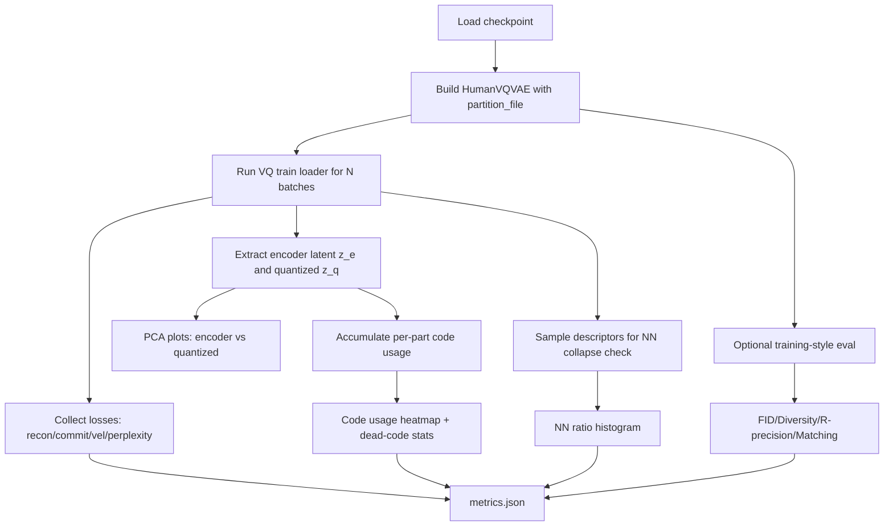
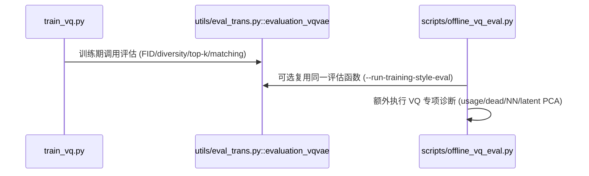

# VQ-VAE 评估：理论依据与实际落地

本文说明 `part-aware-vqvae` 当前离线评估体系的理论依据、实现路径，以及本次对 `net_best_fid.pth` 的实际执行方式。

## 1. 评估目标与核心风险

VQ-VAE 的常见失败并不只体现在重建图像/动作“看起来不够好”，更常见的是表示层面退化：

1. `code collapse / dead code`：大量 codebook 项从未被使用。
2. `encoder 表示塌缩`：量化前 latent 过度集中。
3. `量化后过碎或过聚`：量化后表示分布不健康。
4. `重建质量与离散约束失衡`：`commit loss` 与 `recon loss` 比例异常。
5. `近邻替代可重建`：说明编码区分度不足，存在 collapse 风险。

因此我们采用“分布指标 + 表示健康度 + collapse 检测”的组合评估。

## 2. 理论依据（我们评什么、为什么）

### 2.1 训练同款生成质量指标

与训练阶段保持一致，使用 `FID / Diversity / R-Precision / Matching Score`：

- FID：比较真实与重建动作 embedding 的高斯分布差异。
- Diversity：衡量样本覆盖与多样性。
- R-Precision + Matching：衡量 text-motion 对齐质量。

代码入口：[`utils/eval_trans.py:22`](utils/eval_trans.py#L22)（`evaluation_vqvae`）与 [`train_vq.py:154`](train_vq.py#L154)（训练时调用）。

### 2.2 表示健康度指标（VQ 专项）

1. `code usage / dead code / active ratio`
- 对每个 part 的 code 统计使用频次。
- dead code = 使用次数为 0 的 code。
- active ratio = `1 - dead/num_codes`。

2. `usage perplexity`
- 记 code 使用分布为 `p(k)`，则 perplexity = `exp(H(p))`。
- 越高通常表示使用更均衡；过低意味着少量 code 垄断。

3. `commit/recon 关系`
- 监控 `commit_over_recon = commit_mean / recon_mean`。
- 可用于判断离散约束是否“压过”重建目标。

### 2.3 Collapse 检测

`nearest-neighbor reconstruction ratio`：

- 对样本 `x_i`，取 latent 描述符空间最近邻 `x_j`。
- 比较 `MSE(recon(x_j), x_i)` 与 `MSE(recon(x_i), x_i)`。
- 若比值接近 1 且大面积成立，说明“别人重建也能还原我”，编码区分度不足。

## 3. 实现流程（实际怎么做）



核心实现文件：[`scripts/offline_vq_eval.py:57`](scripts/offline_vq_eval.py#L57)。

### 3.1 关键实现模块

- 参数与入口：[`scripts/offline_vq_eval.py:57`](scripts/offline_vq_eval.py#L57)
- 加载 checkpoint + 模型构建：[`scripts/offline_vq_eval.py:106`](scripts/offline_vq_eval.py#L106), [`scripts/offline_vq_eval.py:117`](scripts/offline_vq_eval.py#L117)
- latent 提取与 code usage 统计：[`scripts/offline_vq_eval.py:237`](scripts/offline_vq_eval.py#L237)
- usage perplexity/dead code 计算：[`scripts/offline_vq_eval.py:285`](scripts/offline_vq_eval.py#L285)
- 训练同款评估桥接：[`scripts/offline_vq_eval.py:296`](scripts/offline_vq_eval.py#L296)
- 主流程（收集、作图、导出 json）：[`scripts/offline_vq_eval.py:348`](scripts/offline_vq_eval.py#L348)

## 4. Part-aware VQ 结构与评估对象

`HumanVQVAE` 是按 body part 分块编码与量化：

- `partSeg` 从 `partition_file` 加载：[`models/vqvae.py:56`](models/vqvae.py#L56)
- 每个 part 独立 encoder + quantizer：[`models/vqvae.py:80`](models/vqvae.py#L80), [`models/vqvae.py:118`](models/vqvae.py#L118)
- `encode` 将各 part code 拼接输出：[`models/vqvae.py:136`](models/vqvae.py#L136)
- `forward` 输出重建、commit、perplexity：[`models/vqvae.py:205`](models/vqvae.py#L205)

这决定了我们在评估中需要做“分 part usage/perplexity/dead code”而不是只做全局统计。

## 5. 本次实际评估（你指定 checkpoint）

评估对象：

- checkpoint: `/scratch/ts1v23/workspace/MMM/output/vq/2026-02-18-11-48-59_vq_data_driven/net_best_fid.pth`

执行方式（在现有 allocation 内跑 GPU）：

```bash
python scripts/offline_vq_eval.py \
  --ckpt output/vq/2026-02-18-11-48-59_vq_data_driven/net_best_fid.pth \
  --device cuda \
  --num-batches 40 \
  --batch-size 128 \
  --run-training-style-eval \
  --out-dir offline_eval/vq_data_driven_20260218_best_fid
```

输出目录：

- `offline_eval/vq_data_driven_20260218_best_fid/metrics.json`
- `encoder_latent_pca.png`
- `quantized_latent_pca.png`
- `codebook_pca.png`
- `code_usage_heatmap.png`
- `recon_vs_commit.png`
- `nn_recon_ratio_hist.png`

## 6. 结果解读建议

1. 先看 `code_usage_heatmap.png` 与 `dead_codes`：
- 如果某些 part 的 active ratio 很低，优先处理 code collapse。

2. 再看 `encoder_latent_pca.png` vs `quantized_latent_pca.png`：
- 前者看 manifold 连续性；后者看量化后簇结构是否异常离散/拥挤。

3. 再看 `codebook_pca.png`：
- `x` 标记的 dead codes 若持续增多，说明码本利用率退化。

4. 最后结合 `commit_over_recon` 和 `nn_ratio_*`：
- `commit_over_recon` 过高 + `nn_ratio` 异常，通常意味着离散约束过强或表示区分度不足。

## 7. 与训练评估的一致性



训练期评估调用点：[`train_vq.py:154`](train_vq.py#L154), [`train_vq.py:192`](train_vq.py#L192)。
离线复用调用点：[`scripts/offline_vq_eval.py:319`](scripts/offline_vq_eval.py#L319)。

<!-- CODE-REF-SNIPPETS:START -->
## Code Reference Snippets

- [`models/vqvae.py:56`](models/vqvae.py#L56)
```python
        partition_file = getattr(args, "partition_file", None)
```

- [`models/vqvae.py:80`](models/vqvae.py#L80)
```python
        self.limb_encoders = nn.ModuleList([
```

- [`models/vqvae.py:118`](models/vqvae.py#L118)
```python
        self.quantizers = nn.ModuleList(
```

- [`models/vqvae.py:136`](models/vqvae.py#L136)
```python
    def encode(self, x):
```

- [`models/vqvae.py:205`](models/vqvae.py#L205)
```python
    def forward(self, x):
```

- [`scripts/offline_vq_eval.py:57`](scripts/offline_vq_eval.py#L57)
```python
def parse_args() -> argparse.Namespace:
```

- [`scripts/offline_vq_eval.py:106`](scripts/offline_vq_eval.py#L106)
```python
def load_state(path: str) -> Dict[str, torch.Tensor]:
```

- [`scripts/offline_vq_eval.py:117`](scripts/offline_vq_eval.py#L117)
```python
def build_model(args: argparse.Namespace, device: torch.device) -> HumanVQVAE:
```

- [`scripts/offline_vq_eval.py:237`](scripts/offline_vq_eval.py#L237)
```python
@torch.no_grad()
```

- [`scripts/offline_vq_eval.py:285`](scripts/offline_vq_eval.py#L285)
```python
def calc_usage_metrics(usage: torch.Tensor) -> Dict[str, float]:
```

- [`scripts/offline_vq_eval.py:296`](scripts/offline_vq_eval.py#L296)
```python
def maybe_run_training_style_eval(args: argparse.Namespace, model: HumanVQVAE, logger: logging.Logger) -> Dict[str, float]:
```

- [`scripts/offline_vq_eval.py:319`](scripts/offline_vq_eval.py#L319)
```python
    best_fid, _, best_div, best_top1, best_top2, best_top3, best_matching, _, _ = eval_trans.evaluation_vqvae(
```

- [`scripts/offline_vq_eval.py:348`](scripts/offline_vq_eval.py#L348)
```python
def main() -> None:
```

- [`train_vq.py:154`](train_vq.py#L154)
```python
best_fid, best_iter, best_div, best_top1, best_top2, best_top3, best_matching, writer, logger = eval_trans.evaluation_vqvae(args.out_dir, val_loader, net, logger, writer, 0, best_fid=1000, best_iter=0, best_div=100, best_top1=0, best_top2=0, best_top3=0, best_matching=100, eval_wrapper=eval_wrapper)
```

- [`train_vq.py:192`](train_vq.py#L192)
```python
    if nb_iter % args.eval_iter==0 :
```

- [`utils/eval_trans.py:22`](utils/eval_trans.py#L22)
```python
@torch.no_grad()
```

<!-- CODE-REF-SNIPPETS:END -->
